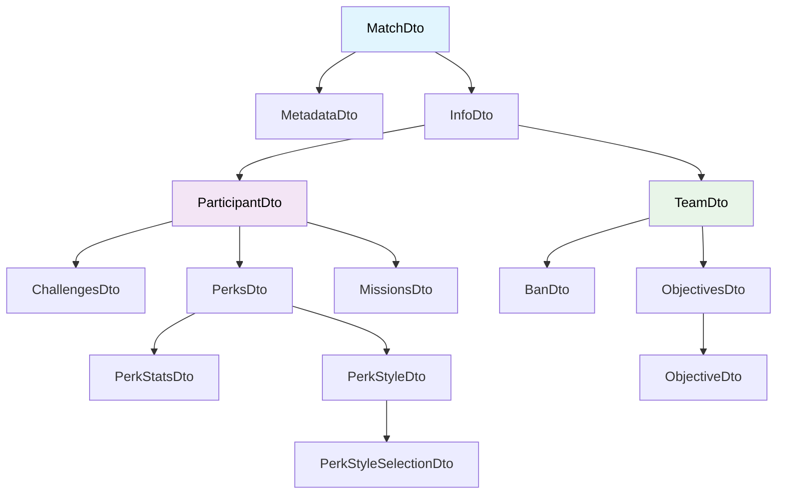
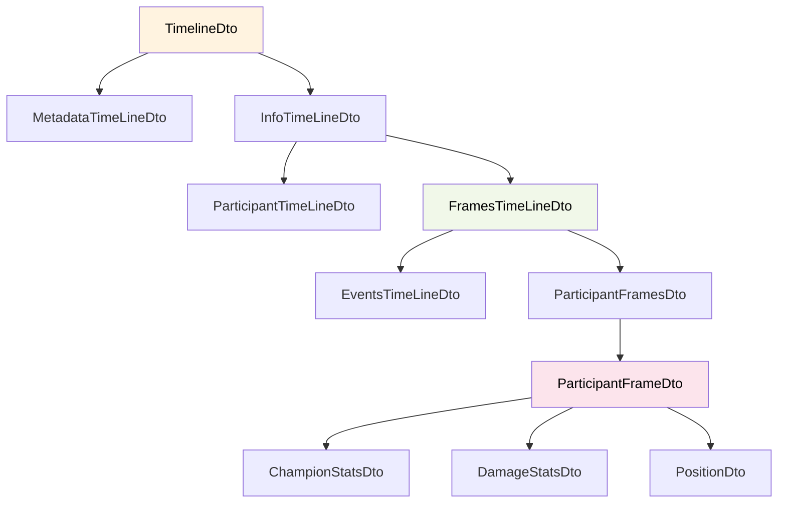
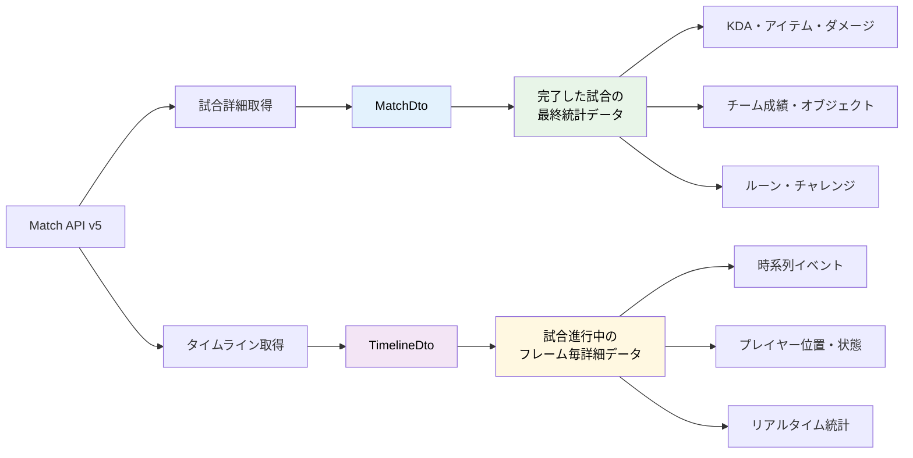

# Match API v5 ドキュメント

## 概要

Match API v5 は League of Legends の試合データにアクセスするためのAPIです。詳細な試合情報、プレイヤー統計、タイムラインイベントを取得できます。

**地域ルーティング**: AMERICAS は NA、BR、LAN、LAS を対象とします。ASIA は KR、JP を対象とします。EUROPE は EUNE、EUW、ME1、TR、RU を対象とします。SEA は OCE、SG2、TW2、VN2 を対象とします。

## エンドポイント

### 1. GET /lol/match/v5/matches/by-puuid/{puuid}/ids

プレイヤーのPUUIDから試合ID一覧を取得

**パラメータ:**
- `puuid` (必須, string): プレイヤーのPUUID
- `startTime` (任意, long): エポック秒のタイムスタンプ。試合リストは2021年6月16日からタイムスタンプの保存を開始しました。startTimeフィルターが設定されている場合、2021年6月16日より前の試合は結果に含まれません。
- `endTime` (任意, long): エポック秒のタイムスタンプ
- `queue` (任意, int): 特定のキューIDで試合ID一覧をフィルタリング。このフィルターはtypeフィルターと相互に包括的で、返される試合IDはqueueとtypeの両方のフィルターに一致する必要があります。
- `type` (任意, string): 試合タイプで試合ID一覧をフィルタリング。オプション: ranked, normal, tourney, tutorial。このフィルターはqueueフィルターと相互に包括的で、返される試合IDはqueueとtypeの両方のフィルターに一致する必要があります。
- `start` (任意, int): デフォルト値は0。開始インデックス。
- `count` (任意, int): デフォルト値は20。有効な値: 0〜100。返す試合IDの数。

**戻り値:** List[string]

### 2. GET /lol/match/v5/matches/{matchId}

試合IDから詳細な試合データを取得

**パラメータ:**
- `matchId` (必須, string): 試合ID

**戻り値:** MatchDto

### 3. GET /lol/match/v5/matches/{matchId}/timeline

試合IDから試合のタイムラインを取得

**パラメータ:**
- `matchId` (必須, string): 試合ID

**戻り値:** TimelineDto

## データ構造

### DTO関連図

#### Match データ構造

#### Timeline データ構造

#### データ関連性の概要

## データ構造詳細

### MatchDto

| Name | Data Type | Description |
|------|-----------|-------------|
| metadata | MetadataDto | 試合のメタデータ |
| info | InfoDto | 試合情報 |

### MetadataDto

| Name | Data Type | Description |
|------|-----------|-------------|
| dataVersion | string | 試合データのバージョン |
| matchId | string | 試合ID |
| participants | List[string] | 参加者のPUUIDリスト |

### InfoDto

| Name | Data Type | Description |
|------|-----------|-------------|
| endOfGameResult | string | ゲームが途中終了で終わったかどうかを示す |
| gameCreation | long | ゲームサーバーでゲームが作成された時のUnixタイムスタンプ（ローディング画面） |
| gameDuration | long | パッチ11.20以前は、gameEndTimestamp - gameStartTimestampで計算されたミリ秒単位のゲーム時間。パッチ11.20以降は、ゲーム内の任意の参加者の最大timePlayed（秒単位）。gameEndTimestampフィールドがレスポンスにない場合はミリ秒として、ある場合は秒として扱うのが最適です。 |
| gameEndTimestamp | long | ゲームサーバーで試合が終了した時のUnixタイムスタンプ。実際の試合終了よりも大幅に長い場合があります。最も信頼できる試合終了タイムスタンプは、gameStartTimestampに任意の参加者の最大プレイ時間を追加することです。このフィールドは2021年10月5日のパッチ11.20でmatch-v5に追加されました。 |
| gameId | long | ゲームID |
| gameMode | string | ゲームモード（Game Constantsドキュメントを参照） |
| gameName | string | ゲーム名 |
| gameStartTimestamp | long | ゲームサーバーで試合が開始された時のUnixタイムスタンプ |
| gameType | string | ゲームタイプ |
| gameVersion | string | ゲームバージョン（最初の2部分でプレイされたパッチを判定可能） |
| mapId | int | マップID（Game Constantsドキュメントを参照） |
| participants | List[ParticipantDto] | 参加者リスト |
| platformId | string | 試合がプレイされたプラットフォーム |
| queueId | int | キューID（Game Constantsドキュメントを参照） |
| teams | List[TeamDto] | チーム情報リスト |
| tournamentCode | string | 試合生成に使用されたトーナメントコード。このフィールドは2021年6月23日のパッチ11.13でmatch-v5に追加されました。 |

### ParticipantDto

| Name | Data Type | Description |
|------|-----------|-------------|
| allInPings | int | 黄色の交差した剣（全員集合ピン） |
| assistMePings | int | 緑の旗（アシスト求めるピン） |
| assists | int | アシスト数 |
| baronKills | int | バロンキル数 |
| bountyLevel | int | 賞金レベル |
| champExperience | int | チャンピオン経験値 |
| champLevel | int | チャンピオンレベル |
| championId | int | チャンピオンID。パッチ11.4（2021年2月18日）以前は無効なchampionIdを返していました。パッチ11.4以前の試合ではchampionNameフィールドでチャンピオンを判定することを推奨します。 |
| championName | string | チャンピオン名 |
| commandPings | int | 青色の汎用ピン（ALT+クリック） |
| championTransform | int | 現在はケインの変身のみに使用。（有効値: 0-なし, 1-スレイヤー, 2-アサシン） |
| consumablesPurchased | int | 消耗品購入数 |
| challenges | ChallengesDto | チャレンジデータ |
| damageDealtToBuildings | int | 建物への与ダメージ |
| damageDealtToObjectives | int | オブジェクトへの与ダメージ |
| damageDealtToTurrets | int | タワーへの与ダメージ |
| damageSelfMitigated | int | 自己軽減ダメージ |
| deaths | int | デス数 |
| detectorWardsPlaced | int | ピンクワード設置数 |
| doubleKills | int | ダブルキル数 |
| dragonKills | int | ドラゴンキル数 |
| eligibleForProgression | boolean | ランク進昇対象フラグ |
| enemyMissingPings | int | 黄色のクエスチョンマーク（敵消失ピン） |
| enemyVisionPings | int | 赤い目玉（敵視界ピン） |
| firstBloodAssist | boolean | ファーストブラッドアシスト |
| firstBloodKill | boolean | ファーストブラッドキル |
| firstTowerAssist | boolean | ファーストタワーアシスト |
| firstTowerKill | boolean | ファーストタワーキル |
| gameEndedInEarlySurrender | boolean | 早期サレンダーで終了。OneStoneチャレンジの派生で、同じインスタンスIDのスペルが2体以上のチャンピオンに最終ダメージを与えたかをチェック。敵でも味方でも構わないが、味方にダメージを与えることはできない。 |
| gameEndedInSurrender | boolean | サレンダーで終了 |
| holdPings | int | ホールドピン |
| getBackPings | int | 黄色の円に水平線（後退ピン） |
| goldEarned | int | 獲得ゴールド |
| goldSpent | int | 消費ゴールド |
| individualPosition | string | individualPositionとteamPositionはゲームサーバーによって計算され、プレイヤーがプレイした最も可能性の高いポジションの異なるバージョンです。individualPositionは他の何にも関係なく、プレイヤーが実際にプレイしたポジションの最良の推測です。teamPositionは各チームが1人のトップ、1人のジャングル、1人のミドルなどを持つという制約を追加した場合のプレイヤーが実際にプレイしたポジションの最良の推測です。一般的にはindividualPositionフィールドよりもteamPositionフィールドを使用することを推奨します。 |
| inhibitorKills | int | インヒビターキル数 |
| inhibitorTakedowns | int | インヒビター撃破数 |
| inhibitorsLost | int | インヒビター失失数 |
| item0 | int | アイテムスロット0 |
| item1 | int | アイテムスロット1 |
| item2 | int | アイテムスロット2 |
| item3 | int | アイテムスロット3 |
| item4 | int | アイテムスロット4 |
| item5 | int | アイテムスロット5 |
| item6 | int | アイテムスロット6（ワード等） |
| itemsPurchased | int | アイテム購入数 |
| killingSprees | int | キリングスプリー数 |
| kills | int | キル数 |
| lane | string | レーン |
| largestCriticalStrike | int | 最大クリティカルダメージ |
| largestKillingSpree | int | 最大キリングスプリー |
| largestMultiKill | int | 最大マルチキル |
| longestTimeSpentLiving | int | 最長生存時間 |
| magicDamageDealt | int | 魔法ダメージ総計 |
| magicDamageDealtToChampions | int | チャンピオンへの魔法ダメージ |
| magicDamageTaken | int | 被魔法ダメージ |
| missions | MissionsDto | ミッションデータ |
| neutralMinionsKilled | int | 中立ミニオンキル数。mNeutralMinionsKilledと等しく、kPetとkJungleMonsterのキル時に増加 |
| needVisionPings | int | 緑のワード（視界要請ピン） |
| nexusKills | int | ネクサスキル数 |
| nexusTakedowns | int | ネクサス撃破数 |
| nexusLost | int | ネクサス喪失数 |
| objectivesStolen | int | オブジェクトスティール数 |
| objectivesStolenAssists | int | オブジェクトスティールアシスト数 |
| onMyWayPings | int | 青い矢印で地面を指す（向かってるピン） |
| participantId | int | 参加者ID |
| playerScore0 | int | プレイヤースコア0 |
| playerScore1 | int | プレイヤースコア1 |
| playerScore2 | int | プレイヤースコア2 |
| playerScore3 | int | プレイヤースコア3 |
| playerScore4 | int | プレイヤースコア4 |
| playerScore5 | int | プレイヤースコア5 |
| playerScore6 | int | プレイヤースコア6 |
| playerScore7 | int | プレイヤースコア7 |
| playerScore8 | int | プレイヤースコア8 |
| playerScore9 | int | プレイヤースコア9 |
| playerScore10 | int | プレイヤースコア10 |
| playerScore11 | int | プレイヤースコア11 |
| pentaKills | int | ペンタキル数 |
| perks | PerksDto | ルーンデータ |
| physicalDamageDealt | int | 物理ダメージ総計 |
| physicalDamageDealtToChampions | int | チャンピオンへの物理ダメージ |
| physicalDamageTaken | int | 被物理ダメージ |
| placement | int | |
| playerAugment1 | int | |
| playerAugment2 | int | |
| playerAugment3 | int | |
| playerAugment4 | int | |
| playerSubteamId | int | |
| pushPings | int | Green minion |
| profileIcon | int | |
| puuid | string | |
| quadraKills | int | |
| riotIdGameName | string | |
| riotIdTagline | string | |
| role | string | |
| sightWardsBoughtInGame | int | |
| spell1Casts | int | |
| spell2Casts | int | |
| spell3Casts | int | |
| spell4Casts | int | |
| subteamPlacement | int | |
| summoner1Casts | int | |
| summoner1Id | int | |
| summoner2Casts | int | |
| summoner2Id | int | |
| summonerId | string | |
| summonerLevel | int | |
| summonerName | string | |
| teamEarlySurrendered | boolean | |
| teamId | int | |
| teamPosition | string | individualPositionとteamPositionはゲームサーバーによって計算され、プレイヤーがプレイした最も可能性の高いポジションの異なるバージョンです。individualPositionは他の何にも関係なく、プレイヤーが実際にプレイしたポジションの最良の推測です。teamPositionは各チームが1人のトップ、1人のジャングル、1人のミドルなどを持つという制約を追加した場合のプレイヤーが実際にプレイしたポジションの最良の推測です。一般的にはindividualPositionフィールドよりもteamPositionフィールドを使用することを推奨します。 |
| timeCCingOthers | int | 他者へのCC時間 |
| timePlayed | int | プレイ時間 |
| totalAllyJungleMinionsKilled | int | 味方ジャングルミニオンキル数 |
| totalDamageDealt | int | 総与ダメージ |
| totalDamageDealtToChampions | int | チャンピオンへの総与ダメージ |
| totalDamageShieldedOnTeammates | int | チームメイトへのシールド量 |
| totalDamageTaken | int | 総被ダメージ |
| totalEnemyJungleMinionsKilled | int | 敵ジャングルミニオンキル数 |
| totalHeal | int | 総回復量。正のヘルスが適用されるたび（ゲーム内の全ヒールだが再生は含まない）に受けた回復量分だけ増加。敵、ジャングルモンスター、自分への回復などを含む |
| totalHealsOnTeammates | int | チームメイトへの総回復量。正のヘルスが適用されるたび（ゲーム内の全ヒールだが再生は含まない）に受けた回復量分だけ増加。修正後の値なので、5ヘルス不足の人を100で回復すると+5 totalHealsOnTeammatesとなる |
| totalMinionsKilled | int | 総ミニオンキル数。mMinionsKilledと等しく、kTeamMinion、kMeleeLaneMinion、kSuperLaneMinion、kRangedLaneMinion、kSiegeLaneMinionのキル時のみ増加 |
| totalTimeCCDealt | int | 総CC与える時間 |
| totalTimeSpentDead | int | 総死亡時間 |
| totalUnitsHealed | int | 総回復ユニット数 |
| tripleKills | int | トリプルキル数 |
| trueDamageDealt | int | 確定ダメージ総計 |
| trueDamageDealtToChampions | int | チャンピオンへの確定ダメージ |
| trueDamageTaken | int | 被確定ダメージ |
| turretKills | int | タワーキル数 |
| turretTakedowns | int | タワー撃破数 |
| turretsLost | int | タワー失失数 |
| unrealKills | int | 超絶キル数 |
| visionScore | int | 視界スコア |
| visionClearedPings | int | 視界除去ピン |
| visionWardsBoughtInGame | int | ゲーム内ワード購入数 |
| wardsKilled | int | ワード破壊数 |
| wardsPlaced | int | ワード設置数 |
| win | boolean | 勝利フラグ |

### ChallengesDto

| Name | Data Type | Description |
|------|-----------|-------------|
| 12AssistStreakCount | int | |
| baronBuffGoldAdvantageOverThreshold | int | |
| controlWardTimeCoverageInRiverOrEnemyHalf | float | |
| earliestBaron | int | |
| earliestDragonTakedown | int | |
| earliestElderDragon | int | |
| earlyLaningPhaseGoldExpAdvantage | int | |
| fasterSupportQuestCompletion | int | |
| fastestLegendary | int | |
| hadAfkTeammate | int | |
| highestChampionDamage | int | |
| highestCrowdControlScore | int | |
| highestWardKills | int | |
| junglerKillsEarlyJungle | int | |
| killsOnLanersEarlyJungleAsJungler | int | |
| laningPhaseGoldExpAdvantage | int | |
| legendaryCount | int | |
| maxCsAdvantageOnLaneOpponent | float | |
| maxLevelLeadLaneOpponent | int | |
| mostWardsDestroyedOneSweeper | int | |
| mythicItemUsed | int | |
| playedChampSelectPosition | int | |
| soloTurretsLategame | int | |
| takedownsFirst25Minutes | int | |
| teleportTakedowns | int | |
| thirdInhibitorDestroyedTime | int | |
| threeWardsOneSweeperCount | int | |
| visionScoreAdvantageLaneOpponent | float | |
| InfernalScalePickup | int | |
| fistBumpParticipation | int | |
| voidMonsterKill | int | |
| abilityUses | int | |
| acesBefore15Minutes | int | |
| alliedJungleMonsterKills | float | |
| baronTakedowns | int | |
| blastConeOppositeOpponentCount | int | |
| bountyGold | int | |
| buffsStolen | int | |
| completeSupportQuestInTime | int | |
| controlWardsPlaced | int | |
| damagePerMinute | float | |
| damageTakenOnTeamPercentage | float | |
| dancedWithRiftHerald | int | |
| deathsByEnemyChamps | int | |
| dodgeSkillShotsSmallWindow | int | |
| doubleAces | int | |
| dragonTakedowns | int | |
| legendaryItemUsed | List[int] | |
| effectiveHealAndShielding | float | |
| elderDragonKillsWithOpposingSoul | int | |
| elderDragonMultikills | int | |
| enemyChampionImmobilizations | int | |
| enemyJungleMonsterKills | float | |
| epicMonsterKillsNearEnemyJungler | int | |
| epicMonsterKillsWithin30SecondsOfSpawn | int | |
| epicMonsterSteals | int | |
| epicMonsterStolenWithoutSmite | int | |
| firstTurretKilled | int | |
| firstTurretKilledTime | float | |
| flawlessAces | int | |
| fullTeamTakedown | int | |
| gameLength | float | |
| getTakedownsInAllLanesEarlyJungleAsLaner | int | |
| goldPerMinute | float | |
| hadOpenNexus | int | |
| immobilizeAndKillWithAlly | int | |
| initialBuffCount | int | |
| initialCrabCount | int | |
| jungleCsBefore10Minutes | float | |
| junglerTakedownsNearDamagedEpicMonster | int | |
| kda | float | |
| killAfterHiddenWithAlly | int | |
| killedChampTookFullTeamDamageSurvived | int | |
| killingSprees | int | |
| killParticipation | float | |
| killsNearEnemyTurret | int | |
| killsOnOtherLanesEarlyJungleAsLaner | int | |
| killsOnRecentlyHealedByAramPack | int | |
| killsUnderOwnTurret | int | |
| killsWithHelpFromEpicMonster | int | |
| knockEnemyIntoTeamAndKill | int | |
| kTurretsDestroyedBeforePlatesFall | int | |
| landSkillShotsEarlyGame | int | |
| laneMinionsFirst10Minutes | int | |
| lostAnInhibitor | int | |
| maxKillDeficit | int | |
| mejaisFullStackInTime | int | |
| moreEnemyJungleThanOpponent | float | |
| multiKillOneSpell | int | OneStoneチャレンジの派生。同じインスタンスIDのスペルが2体以上のチャンピオンに最終ダメージを与えたかをチェック。敵でも味方でも構わないが、味方にダメージを与えることはできない。 |
| multikills | int | |
| multikillsAfterAggressiveFlash | int | |
| multiTurretRiftHeraldCount | int | |
| outerTurretExecutesBefore10Minutes | int | |
| outnumberedKills | int | |
| outnumberedNexusKill | int | |
| perfectDragonSoulsTaken | int | |
| perfectGame | int | |
| pickKillWithAlly | int | |
| poroExplosions | int | |
| quickCleanse | int | |
| quickFirstTurret | int | |
| quickSoloKills | int | |
| riftHeraldTakedowns | int | |
| saveAllyFromDeath | int | |
| scuttleCrabKills | int | |
| shortestTimeToAceFromFirstTakedown | float | |
| skillshotsDodged | int | |
| skillshotsHit | int | |
| snowballsHit | int | |
| soloBaronKills | int | |
| SWARM_DefeatAatrox | int | |
| SWARM_DefeatBriar | int | |
| SWARM_DefeatMiniBosses | int | |
| SWARM_EvolveWeapon | int | |
| SWARM_Have3Passives | int | |
| SWARM_KillEnemy | int | |
| SWARM_PickupGold | float | |
| SWARM_ReachLevel50 | int | |
| SWARM_Survive15Min | int | |
| SWARM_WinWith5EvolvedWeapons | int | |
| soloKills | int | |
| stealthWardsPlaced | int | |
| survivedSingleDigitHpCount | int | |
| survivedThreeImmobilizesInFight | int | |
| takedownOnFirstTurret | int | |
| takedowns | int | |
| takedownsAfterGainingLevelAdvantage | int | |
| takedownsBeforeJungleMinionSpawn | int | |
| takedownsFirstXMinutes | int | |
| takedownsInAlcove | int | |
| takedownsInEnemyFountain | int | |
| teamBaronKills | int | |
| teamDamagePercentage | float | |
| teamElderDragonKills | int | |
| teamRiftHeraldKills | int | |
| tookLargeDamageSurvived | int | |
| turretPlatesTaken | int | |
| turretsTakenWithRiftHerald | int | リフトヘラルド突撃から30秒以内に破壊されたタワーにダメージを与えたプレイヤーがクレジットを受け取る。タワーにダメージを与えなかったプレイヤーはクレジットを受け取らない。 |
| turretTakedowns | int | |
| twentyMinionsIn3SecondsCount | int | |
| twoWardsOneSweeperCount | int | |
| unseenRecalls | int | |
| visionScorePerMinute | float | |
| wardsGuarded | int | |
| wardTakedowns | int | |
| wardTakedownsBefore20M | int | |

### MissionsDto

| Name | Data Type | Description |
|------|-----------|-------------|
| playerScore0 | int | プレイヤースコア0 |
| playerScore1 | int | プレイヤースコア1 |
| playerScore2 | int | プレイヤースコア2 |
| playerScore3 | int | プレイヤースコア3 |
| playerScore4 | int | プレイヤースコア4 |
| playerScore5 | int | プレイヤースコア5 |
| playerScore6 | int | プレイヤースコア6 |
| playerScore7 | int | プレイヤースコア7 |
| playerScore8 | int | プレイヤースコア8 |
| playerScore9 | int | プレイヤースコア9 |
| playerScore10 | int | プレイヤースコア10 |
| playerScore11 | int | プレイヤースコア11 |

### PerksDto

| Name | Data Type | Description |
|------|-----------|-------------|
| statPerks | PerkStatsDto | ステータス系ルーン |
| styles | List[PerkStyleDto] | ルーンスタイルリスト |

### PerkStatsDto

| Name | Data Type | Description |
|------|-----------|-------------|
| defense | int | 防御ルーン |
| flex | int | フレックスルーン |
| offense | int | 攻撃ルーン |

### PerkStyleDto

| Name | Data Type | Description |
|------|-----------|-------------|
| description | string | ルーンスタイル説明 |
| selections | List[PerkStyleSelectionDto] | ルーン選択リスト |
| style | int | ルーンスタイルID |

### PerkStyleSelectionDto

| Name | Data Type | Description |
|------|-----------|-------------|
| perk | int | ルーンID |
| var1 | int | ルーン変数1 |
| var2 | int | ルーン変数2 |
| var3 | int | ルーン変数3 |

### TeamDto

| Name | Data Type | Description |
|------|-----------|-------------|
| bans | List[BanDto] | BANチャンピオンリスト |
| objectives | ObjectivesDto | オブジェクト制圧状況 |
| teamId | int | チームID |
| win | boolean | 勝利フラグ |

### BanDto

| Name | Data Type | Description |
|------|-----------|-------------|
| championId | int | BANチャンピオンID |
| pickTurn | int | BANターン順 |

### ObjectivesDto

| Name | Data Type | Description |
|------|-----------|-------------|
| baron | ObjectiveDto | バロン制圧状況 |
| champion | ObjectiveDto | チャンピオンキル状況 |
| dragon | ObjectiveDto | ドラゴン制圧状況 |
| horde | ObjectiveDto | ホード制圧状況 |
| inhibitor | ObjectiveDto | インヒビター制圧状況 |
| riftHerald | ObjectiveDto | リフトヘラルド制圧状況 |
| tower | ObjectiveDto | タワー制圧状況 |

### ObjectiveDto

| Name | Data Type | Description |
|------|-----------|-------------|
| first | boolean | ファースト獲得フラグ |
| kills | int | 撃破数 |

## Timeline API データ構造

### TimelineDto

| Name | Data Type | Description |
|------|-----------|-------------|
| metadata | MetadataTimeLineDto | 試合メタデータ |
| info | InfoTimeLineDto | 試合情報 |

### MetadataTimeLineDto

| Name | Data Type | Description |
|------|-----------|-------------|
| dataVersion | string | 試合データバージョン |
| matchId | string | 試合ID |
| participants | List[string] | 参加者PUUIDリスト |

### InfoTimeLineDto

| Name | Data Type | Description |
|------|-----------|-------------|
| endOfGameResult | string | ゲーム終了結果（途中終了等を示す） |
| frameInterval | long | フレーム間隔 |
| gameId | long | ゲームID |
| participants | List[ParticipantTimeLineDto] | 参加者リスト |
| frames | List[FramesTimeLineDto] | フレームデータリスト |

### ParticipantTimeLineDto

| Name | Data Type | Description |
|------|-----------|-------------|
| participantId | int | 参加者ID |
| puuid | string | プレイヤーPUUID |

### FramesTimeLineDto

| Name | Data Type | Description |
|------|-----------|-------------|
| events | List[EventsTimeLineDto] | イベントリスト |
| participantFrames | ParticipantFramesDto | 参加者フレーム情報 |
| timestamp | int | タイムスタンプ |

### EventsTimeLineDto

| Name | Data Type | Description |
|------|-----------|-------------|
| timestamp | long | イベントタイムスタンプ |
| realTimestamp | long | 実際のタイムスタンプ |
| type | string | イベントタイプ |

### ParticipantFramesDto

| Name | Data Type | Description |
|------|-----------|-------------|
| 1-9 | ParticipantFrameDto | 各参加者のキー値マッピング |

### ParticipantFrameDto

| Name | Data Type | Description |
|------|-----------|-------------|
| championStats | ChampionStatsDto | チャンピオン統計 |
| currentGold | int | 現在のゴールド |
| damageStats | DamageStatsDto | ダメージ統計 |
| goldPerSecond | int | 秒間ゴールド |
| jungleMinionsKilled | int | ジャングルミニオンキル数 |
| level | int | レベル |
| minionsKilled | int | ミニオンキル数 |
| participantId | int | 参加者ID |
| position | PositionDto | 位置情報 |
| timeEnemySpentControlled | int | 敵を制御した時間 |
| totalGold | int | 総ゴールド |
| xp | int | 経験値 |

### ChampionStatsDto

| Name | Data Type | Description |
|------|-----------|-------------|
| abilityHaste | int | スキルヘイスト |
| abilityPower | int | 魔力 |
| armor | int | 物理防御力 |

## レスポンスエラー

| HTTPステータスコード | 理由 |
|------------------|--------|
| 400 | 不正なリクエスト |
| 401 | 認証されていない |
| 403 | 禁止されている |
| 404 | データが見つからない |
| 405 | 許可されていないメソッド |
| 415 | サポートされていないメディアタイプ |
| 429 | レート制限を超過 |
| 500 | 内部サーバーエラー |
| 502 | 不正なゲートウェイ |
| 503 | サービス利用不可 |
| 504 | ゲートウェイタイムアウト |

## 地域ルーティング

APIリクエストには以下の地域のいずれかを選択してください：
- **AMERICAS**: americas.api.riotgames.com
- **ASIA**: asia.api.riotgames.com  
- **EUROPE**: europe.api.riotgames.com
- **SEA**: sea.api.riotgames.com